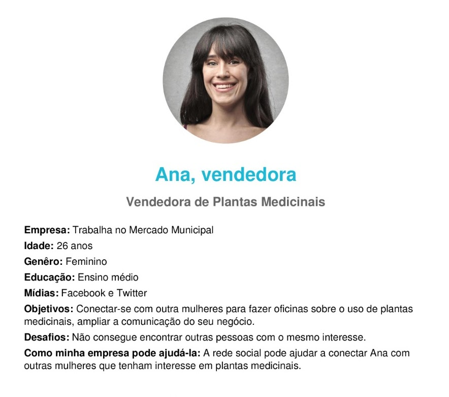
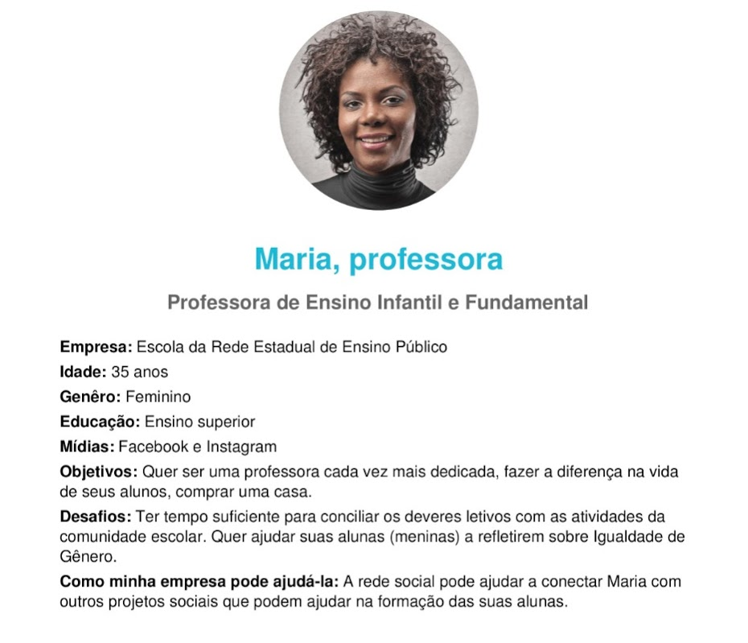
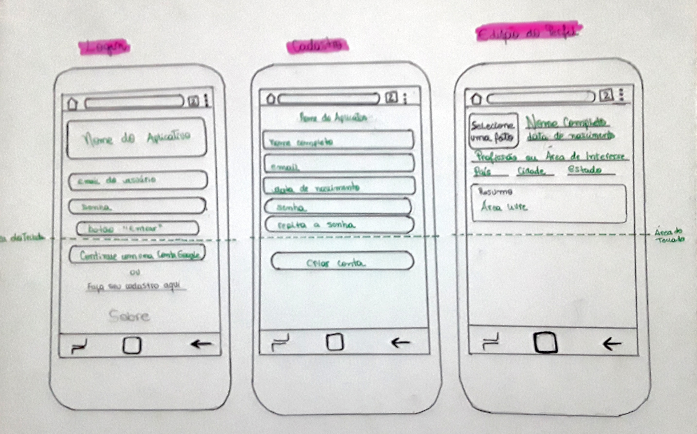

Projeto TPM - Tudo é possível para Mulheres que compartilham ideais!

[Link do Projeto](https://social-network-lab-pnd.web.app/)

## Índice

* [Social Network - Sobre](#Sobre)
* [Organização/Planejamento](#Organização/planejamento)
* [Definição do produto](#Definição-do-produto)
* [Pesquisa com usuários](#Pesquisa-com-usuários)
* [Histórias de usuário](#Histórias-de-usuário)
* [Personas](#Personas)
* [Definição de pronto](#Definição-de-pronto)
* [Protótipo](#Protótipo)
* [Equipe Laboratoria](#Equipe-laboratoria)
* [Agradecimentos](#Agradecimentos)

## Sobre

Apresentamos com muito orgulho o nosso terceiro projeto realizado na Laboratoria!

O objetivo era desenvolver uma rede social capaz de:
- [X] Realizar um cadastro;
- [X] Ter como opções de login uma conta Google ou email e senha;
- [X] Permitir criação de posts;
- [X] Permitir interação com os posts (curtir e descurtir);
- [X] Possibilitar a exclusão de posts;
- [X] Ser uma SPA (Single Page Application);
- [X] Usar Firebase como servidor.

O tema escolhido por nós foi Sororidade. Nossa rede social tem a intenção de unir mulheres para compartilhar oportunidades de trabalho, cursos e dar força umas as outras em um lugar seguro.
O nome TPM foi uma brincadeira com o esteriótipo, mas significa "Tudo é possível para Mulheres".

Escolhemos cores leves que transmitem tranquilidade e segurança e ao mesmo tempo não cause desconforto ao usuário, visto que redes sociais são utilizadas por um longo período durante as interações.

Durante o processo aprendemos a utilizar o Firebase com suas principais ferramentas: Cloud Firestore e Authentication.
Este foi responsável por armazenar os emails de usuários e suas respectivas senhas, postagens e interações.

Regras que incluímos até o momento:

* Apenas um email poderá ser usado por conta; 
* A senha não poderá ser inferior a 6 caracteres;
* Curtir ou amar uma publicação poderá ser feito apenas uma vez por usuário (ao tentar clicar novamente a interação será removida);

## Organização/Planejamento

A organização do Projeto foi feito pelo [Projects do GitHub](https://github.com/Talita-8/SAP005-social-network/projects/1). O projeto foi organizado através de divisões de pequenas tarefas por participante, bem como por diversas sessões de pair programming, fazendo com que o trio vizualize o projeto de forma ampliada e facilite o processo de aprendizado. Diante disso, conseguimos realizar a maior parte das atividades propostas, sendo um desafio imenso aprender a manipular e construir dados a partir de uma ferramenta nova.

## Definição do produto
Tudo é possível para Mulheres que compartilham ideais!
Uma rede social voltada para mulheres, como forma de conectar ideais para construção de projetos que estimulem a igualdade de gênero, nasce um espaço seguro para trocas de informações e interações que conectem coletivos e grupos organizados outras mulheres que buscam empoderamento.
“Sororidade é a ideia de solidariedade entre mulheres, que se apoiam para conquistar a liberdade e a igualdade que desejam. É respeitar, ouvir e dar voz umas às outras sem julgamentos” – Escola Educação
Esse espaço é destinado às mulheres que procuram um espaço seguro para compartilhar planos, sonhos, desafios, oportunidades e encontrar apoio e fortalecimento.
Há potência em mulheres construtoras de igualdade.

## Pesquisa com usuários
  A pesquisa foi feita com 19 usuárias e os dados foram coletados através de [Formulário de pesquisa](https://forms.app/form/5fd7d4098a90056aca10d77d).
  
  Os resultados da pesquisa podem ser conferidos neste [link](https://forms.app/report/5fd7d409e011f0781e22d7e2).

  Com base nas respostas obtidas, constata-se:
  * 90% identifica-se como mulher cisgênero.
  * 74% não conhece uma rede sociail destinada para mulheres.
  * 56% têm muito interesse em participar de redes voltadas para mulheres.
  * As duas redes com que as usuárias mais se identificam são:  Instagram (36%) e Facebook (21%).
  * Facebook (35%) e Twitter (30%), aparecem como as redes que as pessoas menos se identificam.
  * 84% preferem fazer login com a conta do Google, seguida das pessoas que preferem usar o cadastro inicial com 11%.
  * 58% tem interesse em modificar o tamanho da letra.
  * 61% comunicam-se através de fotos e vídeos.

## Histórias de usuário

1. Eu como usuária gostaria de ter como opção de validação o e-mail;
2. Eu como usuária gostaria de ter como opção de validação o login Google;
3. Eu como usuária gostaria de saber quando esqueci de preencher campos de cadastro;
4. Eu como usuária gostaria de saber quando preenchi algum campo de cadastro incorretamente;
5. Eu como usuária gostaria de fazer o meu cadastro em uma nova rede social de forma rápida, simples e fácil.
6. Eu como usuária gostaria de postar um texto sem limites de caracteres.
7. Eu como usuária gostaria de usar a propriedade like e amei nos posts publicados.
8. Eu como usuária gostaria que fosse limitado o uso da propriedade like e amei nos posts publicados conforme a identificação do usuário.
9. Eu como usuária gostaria de visualizar a quantidade de likes e ameis dos posts publicados.
10. Eu como usuária gostaria de excluir likes e ameis dos posts publicados.
11. Eu como usuária gostaria de editar e eliminar publicações.

## Personas

**Ana**

**Maria**

## Definição de pronto

* Atender todos os requisitos para que a usuária realize a operação desejada.
* Diversas usuárias testaram a aplicação.
* O código sempre está devidamente atualizado com o repositório remoto.

## Protótipo

O protótipo é de baixa fidelidade sofreu algumas alterações conforme os testes com as usuárias e dos conhecimentos técnicos adquiridos pela equipe.

###  Equipe Laboratoria

| Lucila Xavier | https://github.com/Lucilaxavier | 
| Mairã Soares | https://github.com/MairaSoares |
| Talita | https://github.com/Talita-8 |

###  Agradecimentos:
Nossa gratidão a toda equipe técnica da Laboratoria pelo suporte diário, somos mais fortes e mais coletivas diante de todo aprendizado que estamos tendo nesse bootcamp.
Confia no processo!
Nossa gratidão mais que especial para as nossas companheiras de squad e de turma.
E vai aquele pensamento positivo para as antigas alunas que estão dando aquele suporte extra.
